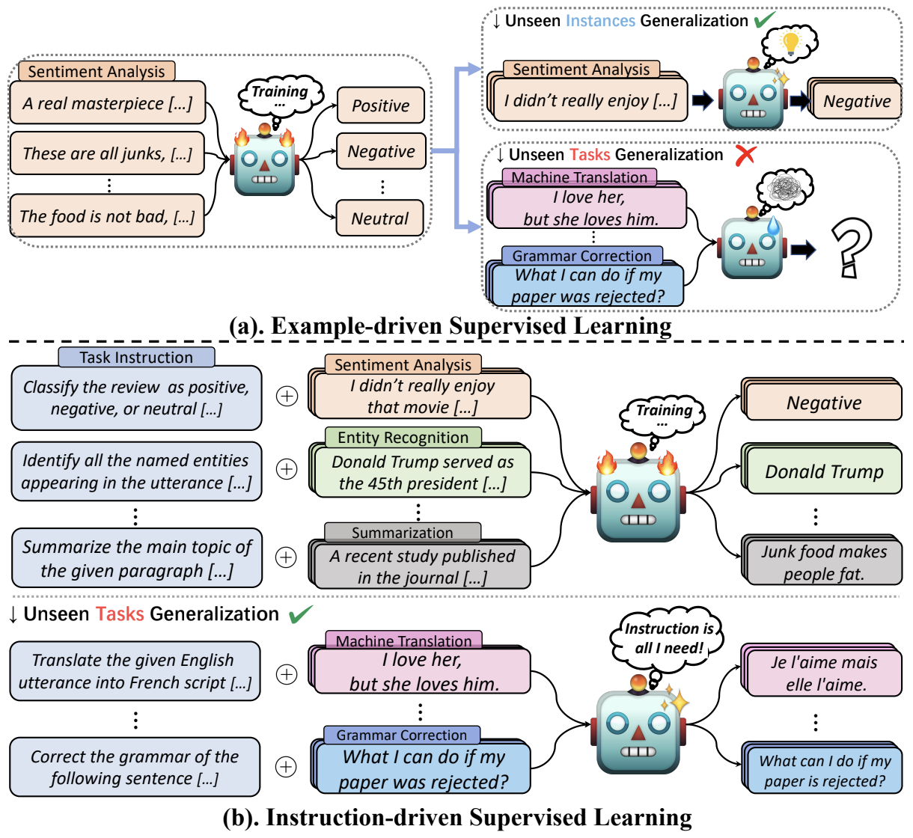
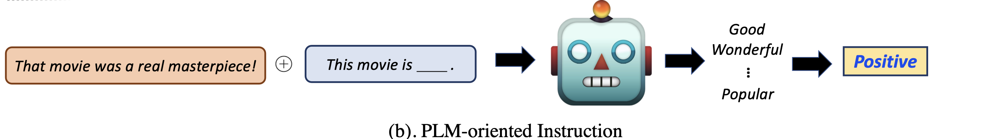
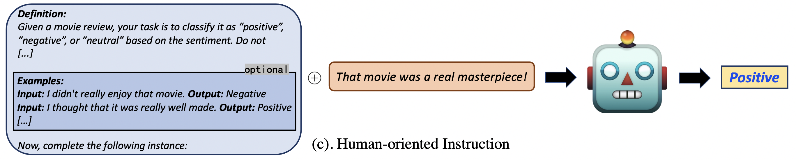

<!-- omit in toc -->
<h1 align="center"> Awesome Instruction Learning </h1>

<p align="center">
  <a href="https://github.com/RenzeLou/awesome-instruction-learning"></a>
  <a href="https://github.com/RenzeLou/awesome-instruction-learning#-star-history"></a>
</p>

<p align="center">
  <a href="https://github.com/RenzeLou/awesome-instruction-learning/commits/main"></a>
  <a href="https://github.com/RenzeLou/awesome-instruction-learning/blob/main/count_number.py"></a>
  <a href="https://github.com/RenzeLou/awesome-instruction-learning/pulls"></a>
</p>

<!-- [](https://github.com/RenzeLou/awesome-instruction-learning) [](https://github.com/RenzeLou/awesome-instruction-learning#-star-history)

[](https://github.com/RenzeLou/awesome-instruction-learning/commits/main) [](https://github.com/RenzeLou/awesome-instruction-learning/blob/main/count_number.py) [](https://github.com/RenzeLou/awesome-instruction-learning/pulls)  -->

<p align="center">
🔥🔥🔥 An awesome reading list of <b>Instruction Tuning</b> (or, put it more comprehensively, <b>Instruction Learning</b>), including <em>papers</em> and <em>datasets</em>. 
</p>

<p align="center">
<i> 👉 Also don't forget to check out our <a href="https://drive.google.com/file/d/1vrx3BSkHlkNO6_nP9G9l9Ape7vEoTOdf/view?usp=sharing"> <b>Latest Survey</b> </a> ! 👀 🤗 </i>
</p>


---

<!-- What is instruction learning?
Why instruction learning?
-->

<!-- TODO
## Our scope:
We aim to stay up-to-date with the most innovative developments in the field and gain valuable insights into the future of instruction-learning technology.👀 organize a systematic and comprehensive overview of instructional learning.

1. Stay up-to-date with the most innovative developments in this field.
2. Gain valuable insights into the future of instruction-learning technology.
3. 
-->


<!-- omit in toc -->
## ❤️ Contribution

This repository is currently maintained by <ins>[Renze Lou](https://renzelou.github.io/) @ PennState</ins> and <ins>[Kai Zhang](https://drogozhang.github.io/) @ OhioState</ins>. **We appreciate any contributions** ❤️.


<!-- **<font color='red'>Work still in progress</font>**  🚀, **we appreciate any suggestions and contributions** ❤️. -->

If you have any suggestions or find any missed papers, feel free to [reach out](https://outlook.office.com/mail/deeplink/compose?mailtouri=mailto%3Amarionojump0722%40gmail.com) or submit a [pull request](https://github.com/RenzeLou/awesome-instruction-learning/pulls):

1. Use following markdown format.

```markdown
**Paper Title.** *Author 1, Author 2, and Author 3.* <ins>Conference/Journal/Preprint</ins> Year. [[pdf](link)]; [[other resources](link)].
```
<!-- >1. **Paper Title.** *Author 1, Author 2, and Author 3.* Conference/Journal/Preprint Year. [[pdf](link)]. -->


2. If one preprint paper has multiple versions, please use **the earliest submitted year**.
   
3. Display the papers in **a year descending order** (the latest, the first).


<!-- omit in toc -->
## 🥳 Citation

Find this repository helpful? 😊😊😊  

Please consider citing our paper. 👇👇👇


<!-- *(**Note that the current version of our survey is only a draft, and we are still working on it.** The first readable version is arriving soon.)* 🚀 -->

```
@article{lou2023instruction,
  title={Is Prompt All You Need? No. A Comprehensive and Broader View of Instruction Learning},
  author={Lou, Renze and Zhang, Kai and Yin, Wenpeng},
  journal={arXiv preprint arXiv:2303.10475},
  year={2023}
}
```

<!-- > **Note**
>
> **The current version of our survey is only a draft, and we are still working on it.** 
> 
> The first readable version is arriving soon. 🚀🚀🚀 -->

<!-- TODO: add survey citation and link -->

---

<!-- omit in toc -->
## 🔍 Table of Contents 

- [1. 💁🏽‍♀️ Introduction](#1-️-introduction)
- [2. 🎓 Surveys and Tutorials](#2--surveys-and-tutorials)
- [3. 🗂️ Taxonomy](#3-️-taxonomy)
  - [3.1 Entailment-oriented Instruction](#31-entailment-oriented-instruction)
  - [3.2 PLM-oriented Instruction](#32-plm-oriented-instruction)
  - [3.3 Human-oriented Instruction](#33-human-oriented-instruction)
- [4. 📊 Analyses](#4--analyses)
  - [4.1 Scale](#41-scale)
  - [4.2 Explanability](#42-explanability)
  - [4.3 Robustness and Safety](#43-robustness-and-safety)
  - [4.4 Negation](#44-negation)
  - [4.5 Other Papers](#45-other-papers)
- [5. 📚 Corpora](#5--corpora)
- [6. 🤖 Applications](#6--applications)
  - [6.1 Human-Computer Interaction](#61-human-computer-interaction)
  - [6.2 Data and Feature Augmentation](#62-data-and-feature-augmentation)
  - [6.3 General-purpose Language Models](#63-general-purpose-language-models)
  - [6.4 Other Papers](#64-other-papers)
- [7. 📖 Extended Reading](#7--extended-reading)
  - [7.1 Instruction Induction](#71-instruction-induction)
  - [7.2 ChatGPT-related Papers](#72-chatgpt-related-papers)
  - [7.3 Human Feedback vs. Model Feedback](#73-human-feedback-vs-model-feedback)
  - [7.4 Scalable Oversight and Alignment](#74-scalable-oversight-and-alignment)
  - [7.5 Other Papers](#75-other-papers)

---


## 1. 💁🏽‍♀️ Introduction

<div align="center">

</div>

<!-- <center>
    
    <br>
    <div style="color:orange; border-bottom: 1px solid #d9d9d9;
    display: inline-block;
    color: #999;
    padding: 2px;">Full Supervised Learning vs. Instruction Learning</div>
</center> -->


Why instruction learning instead of supervised learning?


- 👉 **Affordable.**  For supervised learning, each task usually requires extensive labeled examples 💰. While for instruction learning, each task may require only one instruction and just a few examples 🤩.
- 👉 **One model, all tasks.** An ideal AI system should be able to quickly understand and handle various new tasks 💫.
- 👉 **A promising research direction.** Traditional supervised learning uses labeled instances to represent the task semantics, i.e., training models by observing numerous examples to recover the original task meaning. Therefore, **why not directly use the task instruction**, **which has already occupied the essential task semantics**?

<!-- We all know collecting extensive labeled examples are usually expensive 💰. -->

## 2. 🎓 Surveys and Tutorials

<!-- There are several awesome surveys and tutorials on textual instruction learning. -->
<!-- To our knowledge, our survey is the first one to provide a comprehensive and broader overview of the field of instruction learning. -->
<!-- Since each survey focuses on specific in-context instruction, we attach a label to each of them to distinguish these topics.
, including `prompt`, `demonstrations`, `reasoning`, and `overview` (which means a broader perspective). -->


We use the label  to denote the papers with a more comprehensive perspective. While some other papers are more specific to a certain in-context instruction, including , few-shot , and CoT .

1. **Is Prompt All You Need? No. A Comprehensive and Broader View of Instruction Learning.** *Renze Lou, Kai Zhang, and Wenpeng Yin.* <ins>Preprint</ins> 2023. [[pdf](https://drive.google.com/file/d/1vrx3BSkHlkNO6_nP9G9l9Ape7vEoTOdf/view?usp=sharing)]; [[paper list](https://github.com/RenzeLou/awesome-instruction-learning)]. 
   
2. **Learning from Task Instructions.** *Wenpeng Yin, Qinyuan Ye, Pengfei Liu, Xiang Ren, and Hinrich Schütze.* <ins>EMNLP Tutorial</ins> 2023. 
   
3. **Nature Language Reasoning, A Survey.** *Fei Yu, Hongbo Zhang, and Benyou Wang.* <ins>Preprint</ins> 2023. [[pdf](https://arxiv.org/pdf/2303.14725.pdf)]; [[paper list](https://github.com/FreedomIntelligence/ReasoningNLP)]. 

4. **Pre-train, prompt, and predict: A systematic survey of prompting methods in natural language processing.** *Pengfei Liu, Weizhe Yuan, Jinlan Fu, Zhengbao Jiang, Hiroaki Hayashi, and Graham Neubig.* <ins>ACM Computing Surveys</ins> 2023. [[pdf](https://dl.acm.org/doi/pdf/10.1145/3560815)]; [[website](http://pretrain.nlpedia.ai/)]. 
   
5. **A Survey on In-context Learning**. *Qingxiu Dong, Lei Li, Damai Dai, Ce Zheng, Zhiyong Wu, Baobao Chang, Xu Sun, Jingjing Xu, Lei Li, and Zhifang Sui*. <ins>Preprint</ins> 2022. [[pdf](https://arxiv.org/pdf/2301.00234.pdf)]. 
   
6. **Towards Reasoning in Large Language Models: A Survey.** *Jie Huang, and Kevin Chen-Chuan Chang.* <ins>Preprint</ins> 2022. [[pdf](https://arxiv.org/pdf/2212.10403.pdf)]; [[paper list](https://github.com/jeffhj/LM-reasoning)]. 

7. **Reasoning with Language Model Prompting: A Survey.** *Shuofei Qiao, Yixin Ou, Ningyu Zhang, Xiang Chen, Yunzhi Yao, Shumin Deng, Chuanqi Tan, Fei Huang, and Huajun Chen.* <ins>Preprint</ins> 2022. [[pdf](https://arxiv.org/pdf/2212.09597.pdf)]; [[paper list](https://github.com/zjunlp/Prompt4ReasoningPapers)]. 


## 3. 🗂️ Taxonomy

In our paper, we divide the textual instructions into three categories.

### 3.1 Entailment-oriented Instruction

<!-- Entailment-oriented instruction constructs the task output into the hypothesis and regards the origin task input as the premise. For example, the origin task is to classify `I love this movie` to a `positive` label. While the entailment-oriented paradigm aims to classify whether `Premise: I love this movie` and `Hypothesis: Is it sentiment-positive?` are entailed.  -->

<!-- For example, `Premise: I love this movie` and `Hypothesis: Is it sentiment-positive?` -->


Entailment-oriented instruction regards the task **input** as the **premise**, and constructs the task **output** into the **hypothesis**. It unifies the conventional classification problems into a textual entailment paradigm.

1. **OpenStance: Real-world Zero-shot Stance Detection.** *Hanzi Xu, Slobodan Vucetic, and Wenpeng Yin.* <ins>CoNLL</ins> 2022. [[pdf](https://arxiv.org/pdf/2210.14299.pdf)]; [[code](https://github.com/xhz0809/OpenStance)].
   
2. **Ultra-fine Entity Typing with Indirect Supervision from Natural Language Inference.** *Bangzheng Li, Wenpeng Yin, and Muhao Chen.* <ins>TACL</ins> 2022. [[pdf](https://aclanthology.org/2022.tacl-1.35.pdf)]; [[code](https://github.com/luka-group/lite)]. 
   
3. **Textual Entailment for Event Argument Extraction: Zero- and Few-Shot with Multi-Source Learning.** *Oscar Sainz, Itziar Gonzalez-Dios, Oier Lopez de Lacalle, Bonan Min, and Eneko Agirre.* <ins>Findings of NAACL</ins> 2022. [[pdf](https://aclanthology.org/2022.findings-naacl.187.pdf)]; [[code](https://github.com/luka-group/lite)].

4. **Label Verbalization and Entailment for Effective Zero and Few-Shot Relation Extraction.** *Oscar Sainz, Oier Lopez de Lacalle, Gorka Labaka, Ander Barrena, and Eneko Agirre.* <ins>EMNLP</ins> 2021. [[pdf](https://aclanthology.org/2021.emnlp-main.92.pdf)]; [[code](https://github.com/osainz59/Ask2Transformers)].

5. **Adapting Language Models for Zero-shot Learning by Meta-tuning on Dataset and Prompt Collections.** *Ruiqi Zhong, Kristy Lee, Zheng Zhang, and Dan Klein.* <ins>Findings of EMNLP</ins> 2021. [[pdf](https://aclanthology.org/2021.findings-emnlp.244.pdf)]; [[code](https://github.com/ruiqi-zhong/Meta-tuning)]. 
   
6. **Incremental Few-shot Text Classification with Multi-round New Classes: Formulation, Dataset and System.** *Congying Xia, Wenpeng Yin, Yihao Feng, and Philip Yu.* <ins>NAACL</ins> 2021. [[pdf](https://aclanthology.org/2021.naacl-main.106.pdf)]; [[code](https://github.com/congyingxia/IncrementalFSTC)].
   
7. **ExpBERT: Representation Engineering with Natural Language Explanations.** *Shikhar Murty, Pang Wei Koh, and Percy Liang.* <ins>ACL</ins> 2020. [[pdf](https://aclanthology.org/2020.acl-main.190.pdf)]; [[code](https://github.com/MurtyShikhar/ExpBERT)].
   
8.  **Benchmarking Zero-shot Text Classification: Datasets, Evaluation and Entailment Approach.** *Wenpeng Yin, Jamaal Hay, Dan Roth* *.* <ins>EMNLP</ins> 2019. [[pdf](https://arxiv.org/pdf/1909.00161.pdf)]; [[website](https://cogcomp.seas.upenn.edu/page/publication_view/883)].


### 3.2 PLM-oriented Instruction



PLM-oriented instruction (i.e., prompt) aims to construct a cloze-style input to steer pre-trained language models (PLM) for responses. Here, we diaplay several representative works of PLM-oriented instruction learning. For more works, please refer to [this repository](https://github.com/thunlp/PromptPapers) and [this survey](https://dl.acm.org/doi/pdf/10.1145/3560815).


1. **How Does In-Context Learning Help Prompt Tuning?** *Simeng Sun, Yang Liu, Dan Iter, Chenguang Zhu, and Mohit Iyyer.* <ins>Preprint</ins> 2023. [[pdf](https://arxiv.org/pdf/2302.11521.pdf)]. 
   
2. **Demystifying Prompts in Language Models via Perplexity Estimation.** *Hila Gonen, Srini Iyer, Terra Blevins, Noah A. Smith, and Luke Zettlemoyer.* <ins>Preprint</ins> 2022. [[pdf](https://arxiv.org/pdf/2212.04037.pdf)]. 
   
3. **RLPrompt: Optimizing Discrete Text Prompts with Reinforcement Learning.** *Mingkai Deng, Jianyu Wang, Cheng-Ping Hsieh, and et al.* <ins>EMNLP</ins> 2022. [[pdf](https://arxiv.org/pdf/2205.12548.pdf)]; [[code](https://github.com/mingkaid/rl-prompt)]. 
   
4. **PPT: Pre-trained Prompt Tuning for Few-shot Learning.** *Yuxian Gu, Xu Han, Zhiyuan Liu, and Minlie Huang.* <ins>ACL</ins> 2022. [[pdf](https://arxiv.org/pdf/2109.04332.pdf)]; [[code](https://github.com/thu-coai/PPT)]. 
   
5. **P-Tuning v2: Prompt Tuning Can Be Comparable to Fine-tuning Universally Across Scales and Tasks.** *Xiao Liu, Kaixuan Ji, Yicheng Fu, Weng Lam Tam, Zhengxiao Du, Zhilin Yang, and Jie Tang.* <ins>ACL</ins> 2022. [[pdf](https://arxiv.org/pdf/2110.07602.pdf)]; [[code](https://github.com/THUDM/P-tuning-v2)].
   
6. **KnowPrompt: Knowledge-aware Prompt-tuning with Synergistic Optimization for Relation Extraction.** *Xiang Chen, Ningyu Zhang, Xin Xie, and et al.* <ins>WWW</ins> 2022. [[pdf](http://128.84.21.203/pdf/2104.07650)]; [[code](https://github.com/zjunlp/KnowPrompt)].
   
7. **GPT Understands, Too.** *Xiao Liu, Yanan Zheng, Zhengxiao Du, Ming Ding, Yujie Qian, Zhilin Yang, and Jie Tang.* <ins>Preprint</ins> 2021. [[pdf](https://arxiv.org/pdf/2103.10385.pdf)]; [[code](https://github.com/THUDM/P-tuning)].
   
8.  **Few-Shot Text Generation with Natural Language Instructions.** *Timo Schick and Hinrich Schütze.* <ins>EMNLP</ins> 2021. [[pdf](https://aclanthology.org/2021.emnlp-main.32.pdf)]; [[code](https://github.com/timoschick/pet)]. 
   
9.  **It’s Not Just Size That Matters: Small Language Models Are Also Few-Shot Learners.** *Timo Schick and Hinrich Schütze.* <ins>NAACL</ins> 2021. [[pdf](https://aclanthology.org/2021.naacl-main.185.pdf)]; [[code](https://github.com/timoschick/pet)]. 
   
10. **Learning How to Ask: Querying LMs with Mixtures of Soft Prompts.** *Guanghui Qin and Jason Eisner.* <ins>NAACL</ins> 2021. [[pdf](https://aclanthology.org/2021.naacl-main.410.pdf)]; [[code](https://github.com/hiaoxui/soft-prompts)]. 
   
11. **Prefix-Tuning: Optimizing Continuous Prompts for Generation.** *Xiang Lisa Li and Percy Liang.* <ins>ACL</ins> 2021. [[pdf](https://aclanthology.org/2021.acl-long.353.pdf)]; [[code](https://github.com/XiangLi1999/PrefixTuning)]. 
   
12. **Making Pre-trained Language Models Better Few-shot Learners.** *Tianyu Gao, Adam Fisch, and Danqi Chen.* <ins>ACL</ins> 2021. [[pdf](https://aclanthology.org/2021.acl-long.295.pdf)]; [[code](https://github.com/princeton-nlp/LM-BFF)]. 
   
13. **Template-Based Named Entity Recognition Using BART.** *Leyang Cui, Yu Wu, Jian Liu, Sen Yang, and Yue Zhang.* <ins>Findings of ACL</ins> 2021. [[pdf](https://aclanthology.org/2021.findings-acl.161.pdf)]; [[code](https://github.com/Nealcly/templateNER)]. 
   
14. **Exploiting Cloze-Questions for Few-Shot Text Classification and Natural Language Inference.** *Timo Schick and Hinrich Schütze.* <ins>EACL</ins> 2021. [[pdf](https://aclanthology.org/2021.eacl-main.20.pdf)]; [[code](https://github.com/timoschick/pet)].
   
15. **Language Models are Unsupervised Multitask Learners.** *Alec Radford, Jeffrey Wu, Rewon Child, David Luan, Dario Amodei, and Ilya Sutskever.* <ins>Preprint</ins> 2019. [[pdf](https://life-extension.github.io/2020/05/27/GPT%E6%8A%80%E6%9C%AF%E5%88%9D%E6%8E%A2/language-models.pdf)]. 


### 3.3 Human-oriented Instruction

<!-- **Paper Title.** *Author 1, Author 2, and Author 3.* <ins>Conference/Journal/Preprint</ins> Year. [[pdf](link)]; [[other resources](link)]. -->



Human-oriented instruction is initially designed for human to understand the task and annotate the data, such as the [Amazon MTurk](https://www.mturk.com/) Instructions, which provides sufficient information about the task (e.g., detailed definition).
   
1. **Aligning Instruction Tasks Unlocks Large Language Models as Zero-Shot Relation Extractors.** *Kai Zhang, Bernal Jiménez Gutiérrez, and Yu Su.* <ins>Findings of ACL</ins> 2023. [[pdf](https://arxiv.org/pdf/2305.11159.pdf)]; [[code](https://github.com/OSU-NLP-Group/QA4RE)].
   
2. **Symbol tuning improves in-context learning in language models.** *Jerry Wei, Le Hou, Andrew Lampinen, Xiangning Chen, and et al.* <ins>Preprint</ins> 2023. [[pdf](https://arxiv.org/pdf/2305.08298.pdf)].
   
3. **Small Models are Valuable Plug-ins for Large Language Models.** *Canwen Xu, Yichong Xu, Shuohang Wang, Yang Liu, Chenguang Zhu, and Julian McAuley.* <ins>Preprint</ins> 2023. [[pdf](https://arxiv.org/pdf/2305.08848.pdf)]; [[code](https://github.com/JetRunner/SuperICL)].
   
4. **How Many Data Samples is an Additional Instruction Worth?** *Ravsehaj Singh Puri, Swaroop Mishra, Mihir Parmar, and Chitta Baral.* <ins>Findings of EACL</ins> 2023. [[pdf](https://arxiv.org/pdf/2203.09161.pdf)]; [[code](https://github.com/Ravsehajsinghpuri/Multi-Variant-Instructions)].
   
5. **In-Context Instruction Learning.** *Seonghyeon Ye, Hyeonbin Hwang, Sohee Yang, Hyeongu Yun, Yireun Kim, and Minjoon Seo.* <ins>Preprint</ins> 2023. [[pdf](https://arxiv.org/pdf/2302.14691.pdf)]; [[code](https://github.com/seonghyeonye/ICIL)]. 
   
6. **InstructABSA: Instruction Learning for Aspect Based Sentiment Analysis.** *Kevin Scaria, Himanshu Gupta, Saurabh Arjun Sawant, Swaroop Mishra, and Chitta Baral.* <ins>Preprint</ins> 2023. [[pdf](https://arxiv.org/pdf/2302.08624.pdf)]; [[code](https://github.com/kevinscaria/InstructABSA)].
   
7. **HINT: Hypernetwork Instruction Tuning for Efficient Zero-Shot Generalisation.** *Hamish Ivison, Akshita Bhagia, Yizhong Wang, Hannaneh Hajishirzi, and Matthew Peters.* <ins>Preprint</ins> 2022. [[pdf](https://arxiv.org/pdf/2212.10315.pdf)].

8. **Boosting Natural Language Generation from Instructions with Meta-Learning.** *Budhaditya Deb, Guoqing Zheng, and Ahmed Hassan Awadallah.* <ins>Preprint</ins> 2022. [[pdf](https://arxiv.org/pdf/2210.11617.pdf)]. 
   
9.  **GrIPS: Gradient-free, Edit-based Instruction Search for Prompting Large Language Models.** *Archiki Prasad, Peter Hase, Xiang Zhou, and Mohit Bansal.* <ins>Preprint</ins> 2022. [[pdf](https://arxiv.org/pdf/2203.07281.pdf)]; [[code](https://github.com/archiki/GrIPS)].
   
10. **ConTinTin: Continual Learning from Task Instructions.** *Wenpeng Yin, Jia Li, and Caiming Xiong.* <ins>ACL</ins> 2022. [[pdf](https://aclanthology.org/2022.acl-long.218.pdf)]. 
   
11. **InstructDial: Improving Zero and Few-shot Generalization in Dialogue through Instruction Tuning.** *Prakhar Gupta, Cathy Jiao, Yi-Ting Yeh, Shikib Mehri, Maxine Eskenazi, and Jeffrey P. Bigham.* <ins>EMNLP</ins> 2022. [[pdf]([link](http://128.84.21.203/pdf/2205.12673))]; [[code](https://github.com/prakharguptaz/Instructdial)]. 
   
12. **Learning to Generate Task-Specific Adapters from Task Description.** *Qinyuan Ye and Xiang Ren.* <ins>ACL</ins> 2021. [[pdf](https://aclanthology.org/2021.acl-short.82.pdf)]; [[code](https://github.com/INK-USC/hypter)]. <!-- TODO -->
   
13. **The Turking Test: Can Language Models Understand Instructions?** *Avia Efrat and Omer Levy.* <ins>Preprint</ins> 2020. [[pdf](https://arxiv.org/pdf/2010.11982.pdf)]. 


## 4. 📊 Analyses

### 4.1 Scale
The model and task scale are found to be important for instruction-based fine-tuning. Basically, the larger model scale brings more benefits to the generalization, and so does the task scale. However, some works raised objections (e.g., [Jang et al.](https://arxiv.org/pdf/2302.03202.pdf) and [Wang et al.](https://arxiv.org/pdf/2210.00185.pdf)).

<!-- **Paper Title.** *Author 1, Author 2, and Author 3.* <ins>Conference/Journal/Preprint</ins> Year. [[pdf](link)]; [[other resources](link)].  -->
   
1. **Exploring the Benefits of Training Expert Language Models over Instruction Tuning.** *Joel Jang, Seungone Kim, Seonghyeon Ye, and et al.* <ins>Preprint</ins> 2023. [[pdf](https://arxiv.org/pdf/2302.03202.pdf)]; [[code](https://github.com/joeljang/ELM)]. 
   
2. **The Flan Collection: Designing Data and Methods for Effective Instruction Tuning.** *Shayne Longpre, Le Hou, Tu Vu, and et al.* <ins>Preprint</ins> 2023. [[pdf](https://arxiv.org/pdf/2301.13688.pdf)]; [[code](https://github.com/google-research/FLAN/tree/main/flan/v2)]; [[corpus](https://huggingface.co/datasets/SirNeural/flan_v2)].
   
3. **UL2: Unifying Language Learning Paradigms.** *Yi Tay, Mostafa Dehghani, Vinh Q. Tran, and et al.* <ins>Preprint</ins> 2022. [[pdf](https://arxiv.org/pdf/2205.05131.pdf)]; [[checkpoint](https://huggingface.co/google/flan-ul2)].
   
4. **OPT-IML: Scaling Language Model Instruction Meta Learning through the Lens of Generalization.** *Srinivasan Iyer, Xi Victoria Lin, Ramakanth Pasunuru, and et al.* <ins>Preprint</ins> 2022. [[pdf](https://arxiv.org/pdf/2212.12017.pdf)].   
   
5. **Scaling Instruction-Finetuned Language Models.** *Hyung Won Chung, Le Hou, Shayne Longpre, and et al.* <ins>Preprint</ins> 2022. [[pdf](https://arxiv.org/pdf/2210.11416.pdf)]; [[checkpoint](https://huggingface.co/docs/transformers/model_doc/flan-t5)]. 
   
6. **Learning Instructions with Unlabeled Data for Zero-Shot Cross-Task Generalization.** *Yuxian Gu, Pei Ke, Xiaoyan Zhu, and Minlie Huang.* <ins>EMNLP</ins> 2022. [[pdf](https://arxiv.org/pdf/2210.09175.pdf)]; [[code](https://github.com/thu-coai/UDIT)]. 
   
7. **Emergent Abilities of Large Language Models.** *Jason Wei, Yi Tay, Rishi Bommasani, Colin Raffel, and et al.* <ins>TMLR</ins> 2022. [[pdf](https://openreview.net/pdf?id=yzkSU5zdwD)].
   
8. **Multitask Prompted Training Enables Zero-Shot Task Generalization.** *Victor Sanh, Albert Webson, Colin Raffel, and et al.* <ins>ICLR</ins> 2022. [[pdf](https://openreview.net/pdf?id=9Vrb9D0WI4)]; [[checkpoint](https://github.com/bigscience-workshop/t-zero)]; [[corpus](https://github.com/bigscience-workshop/promptsource)]. 
   
9.  **Finetuned Language Models are Zero-Shot Learners.** *Jason Wei, Maarten Bosma, Vincent Zhao, and et al.* <ins>ICLR</ins> 2022. [[pdf](https://openreview.net/pdf?id=gEZrGCozdqR)]; [[code](https://github.com/google-research/flan)].
    
10. **Zemi: Learning Zero-Shot Semi-Parametric Language Models from Multiple Tasks.** *Zhenhailong Wang, Xiaoman Pan, Dian Yu, Dong Yu, Jianshu Chen, and Heng Ji.* <ins>Preprint</ins> 2022. [[pdf](https://arxiv.org/pdf/2210.00185.pdf)]; [[code](https://github.com/MikeWangWZHL/Zemi)].  
    
11. **ZeroPrompt: Scaling Prompt-Based Pretraining to 1,000 Tasks Improves Zero-Shot Generalization.** *Hanwei Xu, Yujun Chen, Yulun Du, Nan Shao, Yanggang Wang, Haiyu Li, and Zhilin Yang.* <ins>Preprint</ins> 2022. [[pdf](https://arxiv.org/pdf/2201.06910.pdf)]. 
    
12. **The Power of Scale for Parameter-Efficient Prompt Tuning.** *Brian Lester, Rami Al-Rfou, and Noah Constant.* <ins>EMNLP</ins> 2021. [[pdf](https://aclanthology.org/2021.emnlp-main.243.pdf)]; [[code](https://github.com/google-research/prompt-tuning)]. 

### 4.2 Explanability

We exhibit works that focus on the interpretability and reliability of instruction learning, i.e., explaining *when* and *why* instruction can take effect.

<!-- **Paper Title.** *Author 1, Author 2, and Author 3.* <ins>Conference/Journal/Preprint</ins> Year. [[pdf](link)]; [[other resources](link)]. -->
   
1. **REV: Information-Theoretic Evaluation of Free-Text Rationales.** *Hanjie Chen, Faeze Brahman, Xiang Ren, and et al.* <ins>ACL</ins> 2023. [[pdf](https://arxiv.org/pdf/2210.04982.pdf)]; [[code](https://github.com/HanjieChen/REV)].
   
2. **Interpretability at Scale: Identifying Causal Mechanisms in Alpaca.** *Zhengxuan Wu, Atticus Geiger, Christopher Potts, and Noah D. Goodman.* <ins>Preprint</ins> 2023. [[pdf](https://arxiv.org/pdf/2305.08809.pdf)]; [[code](https://github.com/frankaging/align-transformers)].
   
3. **Large Language Models Are Implicitly Topic Models: Explaining and Finding Good Demonstrations for In-Context Learning.** *Xinyi Wang, Wanrong Zhu, Michael Saxon, Mark Steyvers, and William Yang Wang.* <ins>Preprint</ins> 2023. [[pdf](https://arxiv.org/pdf/2301.11916.pdf)]; [[code](https://github.com/WANGXinyiLinda/concept-based-demonstration-selection)].
   
4. **The Learnability of In-Context Learning.** *Noam Wies, Yoav Levine, and Amnon Shashua.* <ins>Preprint</ins> 2023. [[pdf](https://arxiv.org/pdf/2303.07895.pdf)].
   
5. **Why think step-by-step? Reasoning emerges from the locality of experience.** *Ben Prystawski, and Noah D. Goodman.* <ins>Preprint</ins> 2023. [[pdf](https://arxiv.org/pdf/2304.03843.pdf)].
   
6. **Larger language models do in-context learning differently.** *Jerry Wei, Jason Wei, Yi Tay, and et al.* <ins>Preprint</ins> 2023. [[pdf](https://arxiv.org/pdf/2303.03846.pdf)].
   
7. **Can language models learn from explanations in context?** *Andrew K. Lampinen, Ishita Dasgupta, Stephanie C. Y. Chan, and et al.* <ins>Findings of EMNLP</ins> 2022. [[pdf](https://arxiv.org/pdf/2204.02329.pdf)]. 
   
8. **Rethinking the Role of Demonstrations: What Makes In-Context Learning Work?** *Sewon Min, Xinxi Lyu, Ari Holtzman, Mikel Artetxe, Mike Lewis, Hannaneh Hajishirzi, and Luke Zettlemoyer.* <ins>EMNLP</ins> 2022. [[pdf](https://arxiv.org/pdf/2202.12837.pdf)]; [[code](https://github.com/Alrope123/rethinking-demonstrations)]. 
   
9.  **Prompt Waywardness: The Curious Case of Discretized Interpretation of Continuous Prompts.** *Daniel Khashabi, Xinxi Lyu, Sewon Min, and et al.* <ins>NAACL</ins> 2022. [[pdf](https://aclanthology.org/2022.naacl-main.266.pdf)]; [[code](https://github.com/Alrope123/prompt-waywardness)]. 
   
10. **Do Prompt-Based Models Really Understand the Meaning of Their Prompts?.** *Albert Webson and Ellie Pavlick.* <ins>NAACL</ins> 2022. [[pdf](https://aclanthology.org/2022.naacl-main.167.pdf)]; [[code](https://github.com/awebson/prompt_semantics)].
   
11. **Reframing Instructional Prompts to GPTk’s Language.** *Swaroop Mishra, Daniel Khashabi, Chitta Baral, Yejin Choi, and Hannaneh Hajishirzi.* <ins>Findings of ACL</ins> 2022. [[pdf](https://aclanthology.org/2022.findings-acl.50.pdf)]; [[code](https://github.com/allenai/reframing/)]. 
   
12. **What Makes Good In-Context Examples for GPT-3?** *Jiachang Liu, Dinghan Shen, Yizhe Zhang, Bill Dolan, Lawrence Carin, and Weizhu Chen.* <ins>ACL Workshop</ins> 2022. [[pdf](https://aclanthology.org/2022.deelio-1.10.pdf)]; [[code](https://github.com/jiachangliu/KATEGPT3)]. 
   
13. **Fantastically Ordered Prompts and Where to Find Them: Overcoming Few-Shot Prompt Order Sensitivity.** *Yao Lu, Max Bartolo, Alastair Moore, Sebastian Riedel, and Pontus Stenetorp.* <ins>ACL</ins> 2022. [[pdf](https://aclanthology.org/2022.acl-long.556.pdf)].
   
14. **Calibrate Before Use: Improving Few-shot Performance of Language Models.** *Zihao Zhao, Eric Wallace, Shi Feng, Dan Klein, and Sameer Singh.* <ins>ICML</ins> 2021. [[pdf](https://arxiv.org/pdf/2102.09690.pdf)]; [[code](https://github.com/tonyzhaozh/few-shot-learning)].

### 4.3 Robustness and Safety

<!-- **Paper Title.** *Author 1, Author 2, and Author 3.* <ins>Conference/Journal/Preprint</ins> Year. [[pdf](link)]; [[other resources](link)]. -->
   
1. **Poisoning Language Models During Instruction Tuning.** *Alexander Wan, Eric Wallace, Sheng Shen, and Dan Klein.* <ins>ICML</ins> 2023. [[pdf](https://arxiv.org/pdf/2305.00944.pdf)]; [[code](https://github.com/AlexWan0/Poisoning-Instruction-Tuned-Models)].
   
2. **More than you've asked for: A Comprehensive Analysis of Novel Prompt Injection Threats to Application-Integrated Large Language Models.** *Kai Greshake, Sahar Abdelnabi, Shailesh Mishra, Christoph Endres, Thorsten Holz, and Mario Fritz.* <ins>Preprint</ins> 2023. [[pdf](https://arxiv.org/pdf/2302.12173.pdf)]; [[code](https://github.com/greshake/llm-security)]. 
   
3. **Robustness of Learning from Task Instructions.** *Jiasheng Gu, Hanzi Xu, Liangyu Nie, and Wenpeng Yin.* <ins>Preprint</ins> 2022. [[pdf](https://arxiv.org/pdf/2212.03813.pdf)]. 

4. **Learning from Task Descriptions.** *Orion Weller, Nicholas Lourie, Matt Gardner, and Matthew E. Peters.* <ins>EMNLP</ins> 2020. [[pdf](https://aclanthology.org/2020.emnlp-main.105.pdf)]; [[code](https://github.com/allenai/zest)]; [[corpus](https://allenai.org/data/zest)]. 

### 4.4 Negation

Negation expressions, such as `do not` and `avoid doing`, are difficult for models to corretly understand and follow.

1. **Can Large Language Models Truly Understand Prompts? A Case Study with Negated Prompts.** *Joel Jang, Seonghyeon Ye, and Minjoon Seo.* <ins>ICML Workshop</ins> 2023. [[pdf](https://proceedings.mlr.press/v203/jang23a/jang23a.pdf)].
   
2. **Understanding by Understanding Not: Modeling Negation in Language Models.** *Arian Hosseini, Siva Reddy, Dzmitry Bahdanau, and et al.* <ins>NAACL</ins> 2021. [[pdf](https://aclanthology.org/2021.naacl-main.102.pdf)]; [[code](https://github.com/arianhosseini/negation-learning)]. 


### 4.5 Other Papers

<!-- **Paper Title.** *Author 1, Author 2, and Author 3.* <ins>Conference/Journal/Preprint</ins> Year. [[pdf](link)]; [[other resources](link)]. -->
   
1. **Don't Blame the Annotator: Bias Already Starts in the Annotation Instructions.** *Mihir Parmar, Swaroop Mishra, Mor Geva, and Chitta Baral.* <ins>EACL</ins> 2023. [[pdf](https://arxiv.org/pdf/2205.00415.pdf)]; [[code](https://github.com/Mihir3009/instruction-bias)]. 
   
2. **Few-Shot Parameter-Efficient Fine-Tuning is Better and Cheaper than In-Context Learning.** *Haokun Liu, Derek Tam, Mohammed Muqeeth, Jay Mohta, Tenghao Huang, Mohit Bansal, and Colin Raffel.* <ins>NeurIPS</ins> 2022. [[pdf](https://openreview.net/pdf?id=rBCvMG-JsPd)]; [[code](https://github.com/r-three/t-few)]. 
   
3. **A Survey of NLP-Related Crowdsourcing HITs: what works and what does not.** *Jessica Huynh, Jeffrey Bigham, and Maxine Eskenazi.* <ins>Preprint</ins> 2021. [[pdf](https://arxiv.org/pdf/2111.05241.pdf)].


## 5. 📚 Corpora

Nowadays, tuning-based instruction learning methods (aka **Instruction Tuning**) are highly favored by the community, which usually requires a large amount of diverse instruction-following data.

Inspired by [Longpre et al.](https://arxiv.org/pdf/2301.13688.pdf), we list current awesome instruction-tuning corpora in the following table.


<table id="copora-table" style="height: 353px; width: 690px;" width="629">
<tbody>
<tr style="height: 37px;">
<td style="height: 47px; width: 124.992px; text-align: left;" rowspan="2"><strong>Name&nbsp;</strong></td>
<td style="height: 47px; width: 61.2891px; text-align: right;" rowspan="2"><strong>Release</strong></td>
<td style="height: 47px; width: 85.1875px; text-align: center;" rowspan="2"><strong>Data/Code</strong></td>
<td style="height: 37px; width: 144.289px; text-align: center;" colspan="2"><strong>Scale</strong></td>
<td style="height: 47px; width: 109.258px; text-align: center;" rowspan="2"><strong>Language</strong></td>
<td style="width: 124.984px; text-align: center; height: 47px;" rowspan="2"><strong>Annotator</strong></td>
</tr>
<tr style="height: 10px;">
<td style="height: 10px; width: 60.7969px; text-align: right;"><strong>#Tasks</strong></td>
<td style="height: 10px; width: 77.4922px; text-align: right;"><strong>#Ins. (K)</strong></td>
</tr>
<tr style="height: 18px;">
<td style="height: 18px; width: 124.992px; text-align: left;"><a href="https://arxiv.org/pdf/2005.00700.pdf">UnifiedQA</a></td>
<td style="height: 18px; width: 61.2891px; text-align: right;"><span style="text-decoration: underline;">05/2020</span></td>
<td style="height: 18px; width: 85.1875px; text-align: center;"><a href="https://github.com/allenai/unifiedqa">Link</a></td>
<td style="height: 18px; width: 60.7969px; text-align: right;">46</td>
<td style="height: 18px; width: 77.4922px; text-align: right;">750</td>
<td style="height: 18px; width: 109.258px; text-align: center;"></td>
<td style="width: 124.984px; text-align: center; height: 18px;">✍&nbsp;Human</td>
</tr>
<tr style="height: 18px;">
<td style="height: 18px; width: 124.992px; text-align: left;"><a href="https://arxiv.org/pdf/2104.08835.pdf">CrossFit</a></td>
<td style="height: 18px; width: 61.2891px; text-align: right;"><span style="text-decoration: underline;">04/2021</span></td>
<td style="height: 18px; width: 85.1875px; text-align: center;"><a href="https://github.com/INK-USC/CrossFit">Link</a></td>
<td style="height: 18px; width: 60.7969px; text-align: right;">159</td>
<td style="height: 18px; width: 77.4922px; text-align: right;">71,000</td>
<td style="height: 18px; width: 109.258px; text-align: center;"></td>
<td style="width: 124.984px; text-align: center; height: 18px;">✍&nbsp;Human</td>
</tr>
<tr style="height: 18px;">
<td style="height: 18px; width: 124.992px; text-align: left;"><a href="https://arxiv.org/pdf/2104.08773.pdf">Natural Inst. v1</a></td>
<td style="height: 18px; width: 61.2891px; text-align: right;"><span style="text-decoration: underline;">04/2021</span></td>
<td style="height: 18px; width: 85.1875px; text-align: center;"><a href="https://instructions.apps.allenai.org/">Link</a></td>
<td style="height: 18px; width: 60.7969px; text-align: right;">61</td>
<td style="height: 18px; width: 77.4922px; text-align: right;">620</td>
<td style="height: 18px; width: 109.258px; text-align: center;"></td>
<td style="width: 124.984px; text-align: center; height: 18px;">✍&nbsp;Human</td>
</tr>
<tr style="height: 18px;">
<td style="height: 18px; width: 124.992px; text-align: left;"><a href="https://arxiv.org/pdf/2109.01652.pdf">Flan 2021</a></td>
<td style="height: 18px; width: 61.2891px; text-align: right;"><span style="text-decoration: underline;">09/2021</span></td>
<td style="height: 18px; width: 85.1875px; text-align: center;"><a href="https://github.com/google-research/FLAN/tree/main#flan-2021">Link</a></td>
<td style="height: 18px; width: 60.7969px; text-align: right;">62</td>
<td style="height: 18px; width: 77.4922px; text-align: right;">4,400</td>
<td style="height: 18px; width: 109.258px; text-align: center;"></td>
<td style="width: 124.984px; text-align: center; height: 18px;">✍&nbsp;Human</td>
</tr>
<tr style="height: 18px;">
<td style="height: 18px; width: 124.992px; text-align: left;"><a href="https://arxiv.org/pdf/2202.01279.pdf">P3</a></td>
<td style="height: 18px; width: 61.2891px; text-align: right;"><span style="text-decoration: underline;">10/2021</span></td>
<td style="height: 18px; width: 85.1875px; text-align: center;"><a href="https://github.com/bigscience-workshop/promptsource">Link</a></td>
<td style="height: 18px; width: 60.7969px; text-align: right;">62</td>
<td style="height: 18px; width: 77.4922px; text-align: right;">12,000</td>
<td style="height: 18px; width: 109.258px; text-align: center;"></td>
<td style="width: 124.984px; text-align: center; height: 18px;">✍&nbsp;Human</td>
</tr>
<tr style="height: 18px;">
<td style="height: 18px; width: 124.992px; text-align: left;"><a href="https://arxiv.org/pdf/2110.15943.pdf">MetaICL</a></td>
<td style="height: 18px; width: 61.2891px; text-align: right;"><span style="text-decoration: underline;">10/2021</span></td>
<td style="height: 18px; width: 85.1875px; text-align: center;"><a href="https://github.com/facebookresearch/MetaICL">Link</a></td>
<td style="height: 18px; width: 60.7969px; text-align: right;">142</td>
<td style="height: 18px; width: 77.4922px; text-align: right;">3,500</td>
<td style="height: 18px; width: 109.258px; text-align: center;"></td>
<td style="width: 124.984px; text-align: center; height: 18px;">✍&nbsp;Human</td>
</tr>
<tr style="height: 18px;">
<td style="height: 18px; width: 124.992px; text-align: left;"><a href="https://openreview.net/pdf?id=Vzh1BFUCiIX">ExMix</a></td>
<td style="height: 18px; width: 61.2891px; text-align: right;"><span style="text-decoration: underline;">11/2021</span></td>
<td style="height: 18px; width: 85.1875px; text-align: center;"><a href="https://github.com/google-research/text-to-text-transfer-transformer">Link</a></td>
<td style="height: 18px; width: 60.7969px; text-align: right;">107</td>
<td style="height: 18px; width: 77.4922px; text-align: right;">500</td>
<td style="height: 18px; width: 109.258px; text-align: center;"></td>
<td style="width: 124.984px; text-align: center; height: 18px;">✍&nbsp;Human</td>
</tr>
<tr style="height: 18px;">
<td style="height: 18px; width: 124.992px; text-align: left;">
<p><a href="https://arxiv.org/pdf/2204.07705.pdf">SuperNI</a></p>
<p><a href="https://arxiv.org/pdf/2204.07705.pdf">(Natural Inst. v2)</a></p>
</td>
<td style="height: 18px; width: 61.2891px; text-align: right;"><span style="text-decoration: underline;">04/2022</span></td>
<td style="height: 18px; width: 85.1875px; text-align: center;"><a href="https://instructions.apps.allenai.org/">Link</a></td>
<td style="height: 18px; width: 60.7969px; text-align: right;">1,613</td>
<td style="height: 18px; width: 77.4922px; text-align: right;">5,000</td>
<td style="height: 18px; width: 109.258px; text-align: center;"></td>
<td style="width: 124.984px; text-align: center; height: 18px;">✍&nbsp;Human</td>
</tr>
<tr style="height: 18px;">
<td style="height: 18px; width: 124.992px; text-align: left;"><a href="https://arxiv.org/pdf/2210.02414.pdf">GLM</a></td>
<td style="height: 18px; width: 61.2891px; text-align: right;"><span style="text-decoration: underline;">10/2022</span></td>
<td style="height: 18px; width: 85.1875px; text-align: center;"><a href="https://github.com/THUDM/GLM-130B">Link</a></td>
<td style="height: 18px; width: 60.7969px; text-align: right;">77</td>
<td style="height: 18px; width: 77.4922px; text-align: right;">12,000</td>
<td style="height: 18px; width: 109.258px; text-align: center;"></td>
<td style="width: 124.984px; text-align: center; height: 18px;">✍&nbsp;Human</td>
</tr>
<tr style="height: 18px;">
<td style="height: 18px; width: 124.992px; text-align: left;"><a href="https://arxiv.org/pdf/2301.13688.pdf">Flan 2022</a></td>
<td style="height: 18px; width: 61.2891px; text-align: right;"><span style="text-decoration: underline;">10/2022</span></td>
<td style="height: 18px; width: 85.1875px; text-align: center;"><a href="https://github.com/google-research/FLAN/tree/main/flan/v2">Link</a></td>
<td style="height: 18px; width: 60.7969px; text-align: right;">1,836</td>
<td style="height: 18px; width: 77.4922px; text-align: right;">15,000</td>
<td style="height: 18px; width: 109.258px; text-align: center;"></td>
<td style="width: 124.984px; text-align: center; height: 18px;">✍&nbsp;Human</td>
</tr>
<tr style="height: 18px;">
<td style="height: 18px; width: 124.992px; text-align: left;"><a href="https://arxiv.org/pdf/2211.01786.pdf">xP3</a></td>
<td style="height: 18px; width: 61.2891px; text-align: right;"><span style="text-decoration: underline;">11/2022</span></td>
<td style="height: 18px; width: 85.1875px; text-align: center;"><a href="https://huggingface.co/datasets/bigscience/xP3">Link</a></td>
<td style="height: 18px; width: 60.7969px; text-align: right;">71</td>
<td style="height: 18px; width: 77.4922px; text-align: right;">81,000</td>
<td style="height: 18px; width: 109.258px; text-align: center;"></td>
<td style="width: 124.984px; text-align: center; height: 18px;">✍&nbsp;Human</td>
</tr>
<tr style="height: 18px;">
<td style="height: 18px; width: 124.992px; text-align: left;"><a href="https://arxiv.org/pdf/2212.09689.pdf">Unnatural Inst.</a></td>
<td style="height: 18px; width: 61.2891px; text-align: right;"><span style="text-decoration: underline;">12/2022</span></td>
<td style="height: 18px; width: 85.1875px; text-align: center;"><a href="https://github.com/orhonovich/unnatural-instructions">Link</a></td>
<td style="height: 18px; width: 60.7969px; text-align: right;">117</td>
<td style="height: 18px; width: 77.4922px; text-align: right;">64</td>
<td style="height: 18px; width: 109.258px; text-align: center;"></td>
<td style="width: 124.984px; text-align: center; height: 18px;">
<p>🤖 InstructGPT<sub>002</sub></p>
<p><sub><code>text-davinci-002</code></sub></p>
</td>
</tr>
<tr style="height: 18px;">
<td style="height: 18px; width: 124.992px; text-align: left;"><a href="https://arxiv.org/pdf/2212.10560.pdf">Self-Instruct</a></td>
<td style="height: 18px; width: 61.2891px; text-align: right;"><span style="text-decoration: underline;">12/2022</span></td>
<td style="height: 18px; width: 85.1875px; text-align: center;"><a href="https://github.com/yizhongw/self-instruct">Link</a></td>
<td style="height: 18px; width: 60.7969px; text-align: right;">/</td>
<td style="height: 18px; width: 77.4922px; text-align: right;">82</td>
<td style="height: 18px; width: 109.258px; text-align: center;"></td>
<td style="width: 124.984px; text-align: center; height: 18px;">
<p>🤖 GPT-3&nbsp;</p>
<p><code><sub>davinci</sub></code></p>
</td>
</tr>
<tr style="height: 18px;">
<td style="height: 18px; width: 124.992px; text-align: left;"><a href="https://arxiv.org/pdf/2212.12017.pdf">OPT-IML</a></td>
<td style="height: 18px; width: 61.2891px; text-align: right;"><span style="text-decoration: underline;">12/2022</span></td>
<td style="height: 18px; width: 85.1875px; text-align: center;">/</td>
<td style="height: 18px; width: 60.7969px; text-align: right;">2,207</td>
<td style="height: 18px; width: 77.4922px; text-align: right;">18,000</td>
<td style="height: 18px; width: 109.258px; text-align: center;"></td>
<td style="width: 124.984px; text-align: center; height: 18px;">✍&nbsp;Human</td>
</tr>
<tr style="height: 18px;">
<td style="height: 18px; width: 124.992px; text-align: left;"><a href="https://crfm.stanford.edu/2023/03/13/alpaca.html">Alpaca</a></td>
<td style="height: 18px; width: 61.2891px; text-align: right;"><span style="text-decoration: underline;">03/2023</span></td>
<td style="height: 18px; width: 85.1875px; text-align: center;"><a href="https://github.com/tatsu-lab/stanford_alpaca">Link</a></td>
<td style="height: 18px; width: 60.7969px; text-align: right;">/</td>
<td style="height: 18px; width: 77.4922px; text-align: right;">52</td>
<td style="height: 18px; width: 109.258px; text-align: center;"></td>
<td style="width: 124.984px; text-align: center; height: 18px;">
<p>🤖 InstructGPT<sub>003</sub></p>
<p><sub><code>text-davinci-003</code></sub></p>
</td>
</tr>
<tr>
<td style="width: 124.992px; text-align: left;"><a href="https://bair.berkeley.edu/blog/2023/04/03/koala/">Koala</a></td>
<td style="width: 61.2891px; text-align: right;"><span style="text-decoration: underline;">04/2023</span></td>
<td style="width: 85.1875px; text-align: center;">/</td>
<td style="width: 60.7969px; text-align: right;">/</td>
<td style="width: 77.4922px; text-align: right;">/</td>
<td style="width: 109.258px; text-align: center;">
<p></p>
<p></p>
</td>
<td style="width: 124.984px; text-align: center;">
<p>✍&nbsp;Human</p>
<p>🤖 ChatGPT</p>
</td>
</tr>
<tr>
<td style="width: 124.992px; text-align: left;"><a href="https://s3.amazonaws.com/static.nomic.ai/gpt4all/2023_GPT4All_Technical_Report.pdf">GPT4All</a></td>
<td style="width: 61.2891px; text-align: right;"><span style="text-decoration: underline;">04/2023</span></td>
<td style="width: 85.1875px; text-align: center;"><a href="https://huggingface.co/datasets/nomic-ai/gpt4all-j-prompt-generations">Link</a></td>
<td style="width: 60.7969px; text-align: right;">/</td>
<td style="width: 77.4922px; text-align: right;">808</td>
<td style="width: 109.258px; text-align: center;">
<p></p>
<p></p>
</td>
<td style="width: 124.984px; text-align: center;">
<p>✍&nbsp;Human</p>
<p>🤖 ChatGPT</p>
</td>
</tr>
<tr style="height: 18px;">
<td style="height: 18px; width: 124.992px; text-align: left;"><a href="https://arxiv.org/pdf/2304.03277.pdf">Alpaca-gpt4</a></td>
<td style="height: 18px; width: 61.2891px; text-align: right;"><span style="text-decoration: underline;">04/2023</span></td>
<td style="height: 18px; width: 85.1875px; text-align: center;"><a href="https://github.com/Instruction-Tuning-with-GPT-4/GPT-4-LLM">Link</a></td>
<td style="height: 18px; width: 60.7969px; text-align: right;">/</td>
<td style="height: 18px; width: 77.4922px; text-align: right;">113</td>
<td style="height: 18px; width: 109.258px; text-align: center;"></td>
<td style="width: 124.984px; text-align: center; height: 18px;">
<p>🤖 GPT-4&nbsp;</p>
<p><sub><code>gpt-4</code></sub></p>
</td>
</tr>
<tr>
<td style="width: 124.992px; text-align: left;"><a href="https://vicuna.lmsys.org/">Vicuna</a></td>
<td style="width: 61.2891px; text-align: right;"><span style="text-decoration: underline;">04/2023</span></td>
<td style="width: 85.1875px; text-align: center;">/</td>
<td style="width: 60.7969px; text-align: right;">/</td>
<td style="width: 77.4922px; text-align: right;">76</td>
<td style="width: 109.258px; text-align: center;">
<p></p>
<p></p>
</td>
<td style="width: 124.984px; text-align: center;">
<p>✍&nbsp;Human</p>
<p>🤖 ChatGPT</p>
</td>
</tr>
<tr style="height: 18px;">
<td style="height: 18px; width: 124.992px; text-align: left;"><a href="https://www.databricks.com/blog/2023/04/12/dolly-first-open-commercially-viable-instruction-tuned-llm">Dolly</a></td>
<td style="height: 18px; width: 61.2891px; text-align: right;"><span style="text-decoration: underline;">04/2023</span></td>
<td style="height: 18px; width: 85.1875px; text-align: center;"><a href="https://github.com/databrickslabs/dolly/tree/master/data">Link</a></td>
<td style="height: 18px; width: 60.7969px; text-align: right;">/</td>
<td style="height: 18px; width: 77.4922px; text-align: right;">15</td>
<td style="height: 18px; width: 109.258px; text-align: center;"></td>
<td style="width: 124.984px; text-align: center; height: 18px;">✍&nbsp;Human</td>
</tr>
<tr>
<td style="width: 124.992px; text-align: left;"><a href="https://drive.google.com/file/d/10iR5hKwFqAKhL3umx8muOWSRm7hs5FqX/view">Oasst</a></td>
<td style="width: 61.2891px; text-align: right;"><span style="text-decoration: underline;">04/2023</span></td>
<td style="width: 85.1875px; text-align: center;"><a href="https://huggingface.co/datasets/OpenAssistant/oasst1">Link</a></td>
<td style="width: 60.7969px; text-align: right;">/</td>
<td style="width: 77.4922px; text-align: right;">84</td>
<td style="width: 109.258px; text-align: center;">
<p></p>
<p></p>
</td>
<td style="width: 124.984px; text-align: center;">✍&nbsp;Human</td>
</tr>
<tr>
<td style="width: 124.992px; text-align: left;"><a href="https://arxiv.org/pdf/2304.08460.pdf">LongForm</a></td>
<td style="width: 61.2891px; text-align: right;"><span style="text-decoration: underline;">04/2023</span></td>
<td style="width: 85.1875px; text-align: center;"><a href="https://github.com/akoksal/LongForm">Link</a></td>
<td style="width: 60.7969px; text-align: right;">/</td>
<td style="width: 77.4922px; text-align: right;">27</td>
<td style="width: 109.258px; text-align: center;">
</td>
<td style="width: 124.984px; text-align: center;">
<p>✍&nbsp;Human</p>
<p>🤖 InstructGPT<sub>003</sub></p>
<p><sub><code>text-davinci-003</code></sub></p>
</td>
</tr>
<tr style="height: 18px;">
<td style="height: 18px; width: 124.992px; text-align: left;"><a href="https://arxiv.org/pdf/2304.07995.pdf">Symbolic-Instruct</a></td>
<td style="height: 18px; width: 61.2891px; text-align: right;"><span style="text-decoration: underline;">04/2023</span></td>
<td style="height: 18px; width: 85.1875px; text-align: center;"><a href="https://huggingface.co/datasets/sail/symbolic-instruction-tuning">Link</a></td>
<td style="height: 18px; width: 60.7969px; text-align: right;">/</td>
<td style="height: 18px; width: 77.4922px; text-align: right;">796</td>
<td style="height: 18px; width: 109.258px; text-align: center;"></td>
<td style="width: 124.984px; text-align: center; height: 18px;">
<p>✍&nbsp;Human</p>
<p>Synthetic Examples</p>
</td>
</tr>
</tr>
<tr>
<td style="width: 124.992px; text-align: left;"><a href="https://arxiv.org/pdf/2304.14402.pdf">LaMini</a></td>
<td style="width: 61.2891px; text-align: right;"><span style="text-decoration: underline;">04/2023</span></td>
<td style="width: 85.1875px; text-align: center;"><a href="https://huggingface.co/datasets/MBZUAI/LaMini-instruction">Link</a></td>
<td style="width: 60.7969px; text-align: right;">/</td>
<td style="width: 77.4922px; text-align: right;">2,580</td>
<td style="width: 109.258px; text-align: center;">
</td>
<td style="width: 124.984px; text-align: center;">
<p>🤖 ChatGPT</p>
</td>
</tr>
<tr>
<td style="width: 124.992px; text-align: left;"><a href="https://arxiv.org/pdf/2305.09857.pdf">COEDIT</a></td>
<td style="width: 61.2891px; text-align: right;"><span style="text-decoration: underline;">05/2023</span></td>
<td style="width: 85.1875px; text-align: center;"><a href="https://github.com/vipulraheja/coedit">Link</a></td>
<td style="width: 60.7969px; text-align: right;">/</td>
<td style="width: 77.4922px; text-align: right;">82</td>
<td style="width: 109.258px; text-align: center;">
</td>
<td style="width: 124.984px; text-align: center;">
<p>✍&nbsp;Human</p>
<!-- <p>collecting from existing text-editing datasets</p> -->
</td>
</tr>
<tr>
<td style="width: 124.992px; text-align: left;"><a href="https://arxiv.org/pdf/2305.14233.pdf">UltraChat</a></td>
<td style="width: 61.2891px; text-align: right;"><span style="text-decoration: underline;">05/2023</span></td>
<td style="width: 85.1875px; text-align: center;"><a href="https://huggingface.co/datasets/stingning/ultrachat">Link</a></td>
<td style="width: 60.7969px; text-align: right;">/</td>
<td style="width: 77.4922px; text-align: right;">1,500</td>
<td style="width: 109.258px; text-align: center;">
<p></p>
<p></p>
</td>
<td style="width: 124.984px; text-align: center;">
<p>🤖 ChatGPT</p>
</td>
</tr>
<tr>
<td style="width: 124.992px; text-align: left;"><a href="https://arxiv.org/pdf/2305.14045.pdf">CoT Collection</a></td>
<td style="width: 61.2891px; text-align: right;"><span style="text-decoration: underline;">05/2023</span></td>
<td style="width: 85.1875px; text-align: center;"><a href="https://github.com/kaistAI/CoT-Collection">Link</a></td>
<td style="width: 60.7969px; text-align: right;">1,060</td>
<td style="width: 77.4922px; text-align: right;">1,880</td>
<td style="width: 109.258px; text-align: center;"><p></p>
</td>
<td style="width: 124.984px; text-align: center;">
<p>🤖 Codex</p>
</td>
</tr>
<tr>
<td style="width: 124.992px; text-align: left;"><a href="https://arxiv.org/pdf/2305.14327.pdf">Dynosaur</a></td>
<td style="width: 61.2891px; text-align: right;"><span style="text-decoration: underline;">05/2023</span></td>
<td style="width: 85.1875px; text-align: center;"><a href="https://dynosaur-it.github.io/">Link</a></td>
<td style="width: 60.7969px; text-align: right;">5,740</td>
<td style="width: 77.4922px; text-align: right;">801</td>
<td style="width: 109.258px; text-align: center;">
</td>
<td style="width: 124.984px; text-align: center;">
<p>🤖 ChatGPT</p>
</td>
</tr>
</tbody>
</table>

<!-- Some Notes for the alpaca:
1. The stanford-alpaca paper is not yet published. It is mainly based on the data generation pipline of Self-Instruct, where the main difference is the author uses InstructGPT-3.5 (text-davinci-003) to replace the GPT-3 (davinci). Besides, they also change the prompt, decoding strategy, and remove the cls tasks discrimination.
2. Alpaca-gpt4 is based on alpaca, the 52k english instructions (w/ optional inputs) are directly collected from alpaca. The main differences are: (a) using ChatGPT to translate 52k English instructions to parallel Chinese instructions (w/ optional inputs); (b) using GPT-4 to replace GPT-3.5 to annotate the outputs of these bilingual instructions; (c) additionally adopting the data generation pipline of Unnatural Instructions with GPT-4 as the annotation model.
 -->


<!-- Since I have already displayed the following data-related papers in the table above, I will not list them explicitly here.

1. **Self-Instruct: Aligning Language Model with Self Generated Instructions.** *Yizhong Wang, Yeganeh Kordi, Swaroop Mishra, Alisa Liu, Noah A. Smith, Daniel Khashabi, and Hannaneh Hajishirzi.* <ins>Preprint</ins> 2022. [[pdf](https://arxiv.org/pdf/2212.10560.pdf)]; [[corpus](https://github.com/yizhongw/self-instruct)].
   
2. **Unnatural Instructions: Tuning Language Models with (Almost) No Human Labor.** *Or Honovich, Thomas Scialom, Omer Levy, and Timo Schick.* <ins>Preprint</ins> 2022. [[pdf](https://arxiv.org/pdf/2212.09689.pdf)]; [[corpus](https://github.com/orhonovich/unnatural-instructions)]. 
   
3. **Super-NaturalInstructions: Generalization via Declarative Instructions on 1600+ NLP Tasks.** *Yizhong Wang, Swaroop Mishra, Pegah Alipoormolabashi, and et al.* <ins>EMNLP</ins> 2022. [[pdf](https://arxiv.org/pdf/2204.07705.pdf)]; [[corpus](https://instructions.apps.allenai.org/)]. 
   
4. **Cross-Task Generalization via Natural Language Crowdsourcing Instructions.** *Swaroop Mishra, Daniel Khashabi, Chitta Baral, and Hannaneh Hajishirzi.* <ins>ACL</ins> 2022. [[pdf](https://aclanthology.org/2022.acl-long.244.pdf)]; [[corpus](https://instructions.apps.allenai.org/)]. 
   
5. **PromptSource: An Integrated Development Environment and Repository for Natural Language Prompts.** *Stephen Bach, Victor Sanh, Zheng Xin Yong, and et al.* <ins>ACL</ins> 2022. [[pdf](https://aclanthology.org/2022.acl-demo.9.pdf)]; [[toolkit](https://github.com/bigscience-workshop/promptsource)]; [[corpus](https://huggingface.co/datasets/bigscience/P3)]. -->


## 6. 🤖 Applications

### 6.1 Human-Computer Interaction

Instructions are used in various human-computer interaction (HCI) tasks, such as virtual assistants, chatbots, etc. 


1. **Help me write a poem: Instruction Tuning as a Vehicle for Collaborative Poetry Writing.** *Tuhin Chakrabarty, Vishakh Padmakumar, and He He.* <ins>EMNLP</ins> 2022. [[pdf](https://arxiv.org/pdf/2210.13669.pdf)]; [[code](https://github.com/vishakhpk/creative-instructions)]. 
   
2. **HELP ME THINK: A Simple Prompting Strategy for Non-experts to Create Customized Content with Models.** *Swaroop Mishra, and Elnaz Nouri.* <ins>Preprint</ins> 2022. [[pdf](https://arxiv.org/pdf/2208.08232.pdf)]. 
   
3. **EditEval: An Instruction-Based Benchmark for Text Improvements.** *Jane Dwivedi-Yu, Timo Schick, Zhengbao Jiang, and et al.* <ins>Preprint</ins> 2022. [[pdf](https://arxiv.org/pdf/2209.13331.pdf)]; [[code](https://github.com/facebookresearch/EditEval)]; [[website](https://eval.ai/web/challenges/challenge-page/1866/overview)].
   
4. **Communicating Natural Programs to Humans and Machines.** *Sam Acquaviva, Yewen Pu, Marta Kryven, and et al.* <ins>NeurIPS Workshop</ins> 2022. [[pdf](https://openreview.net/pdf?id=OxFoLTKDcNm)]; [[code](https://github.com/samacqua/LARC)]. 
   
5. **Interactive Task Learning from GUI-Grounded Natural Language Instructions and Demonstrations.** *Toby Jia-Jun Li, Tom Mitchell, and Brad Myers.* <ins>ACL Demo</ins> 2020. [[pdf](https://aclanthology.org/2020.acl-demos.25.pdf)]; [[code](https://github.com/tobyli/Sugilite_development)]; [[video](https://www.youtube.com/watch?v=tdHEk-GeaqE)].
   
6. **Multi-Modal Interactive Task Learning from Demonstrations and Natural Language Instructions.** *Toby Jia-Jun Li.* <ins>UIST</ins> 2020. [[pdf](https://dl.acm.org/doi/pdf/10.1145/3379350.3415803)]; [[code](https://github.com/tobyli/Sugilite_development)].
   
7. **Pre-Learning Environment Representations for Data-Efficient Neural Instruction Following.** *David Gaddy, and Dan Klein.* <ins>ACL</ins> 2019. [[pdf](https://aclanthology.org/P19-1188.pdf)]. 
   
8. **VirtualHome: Simulating Household Activities via Programs.** *Xavier Puig, Kevin Ra, Marko Boben, and et al.* <ins>CVPR</ins> 2018. [[pdf](https://openaccess.thecvf.com/content_cvpr_2018/papers/Puig_VirtualHome_Simulating_Household_CVPR_2018_paper.pdf)]; [[website](http://virtual-home.org/)]. 
   
9.  **Natural Language Communication with Robots.** *Yonatan Bisk, Deniz Yuret, and Daniel Marcu.* <ins>NAACL</ins> 2016. [[pdf](https://aclanthology.org/N16-1089.pdf)]; [[website](https://groundedlanguage.github.io/)].
    
10. **Jointly Learning to Parse and Perceive: Connecting Natural Language to the Physical World.** *Jayant Krishnamurthy, and Thomas Kollar.* <ins>TACL</ins> 2013. [[pdf](http://rtw.ml.cmu.edu/tacl2013_lsp/tacl2013-krishnamurthy-kollar.pdf)]; [[code](http://rtw.ml.cmu.edu/tacl2013_lsp/)]. 

11. **Weakly Supervised Learning of Semantic Parsers for Mapping Instructions to Actions.** *Yoav Artzi, and Luke Zettlemoyer.* <ins>TACL</ins> 2013. [[pdf](https://aclanthology.org/Q13-1005.pdf)].
    
12. **Unsupervised PCFG Induction for Grounded Language Learning with Highly Ambiguous Supervision.** *Joohyun Kim, and Raymond Mooney.* <ins>EMNLP</ins> 2012. [[pdf](https://aclanthology.org/D12-1040.pdf)].
    
13. **A joint model of language and perception for grounded attribute learning.** *Cynthia Matuszek, Nicholas FitzGerald, Luke Zettlemoyer, Liefeng Bo, and Dieter Fox.* <ins>ICML</ins> 2012. [[pdf](https://arxiv.org/pdf/1206.6423.pdf)]. 
    
14. **Learning to Interpret Natural Language Instructions.** *Monica Babeş-Vroman, James MacGlashan, Ruoyuan Gao, and et al.* <ins>ACL Workshop</ins> 2012. [[pdf](https://aclanthology.org/W12-2801.pdf)]. 
    
15. **Fast Online Lexicon Learning for Grounded Language Acquisition.** *David Chen.* <ins>ACL</ins> 2012. [[pdf](https://aclanthology.org/P12-1045.pdf)].
    
16. **Learning to Win by Reading Manuals in a Monte-Carlo Framework.** *S.R.K. Branavan, David Silver, and Regina Barzilay.* <ins>ACL</ins> 2011. [[pdf](https://aclanthology.org/P11-1028.pdf)]; [[website](http://groups.csail.mit.edu/rbg/code/civ/)].
    
17. **Learning from natural instructions.** *Dan Goldwasse, and Dan Roth.* <ins>IJCAI</ins> 2011. [[pdf](https://citeseerx.ist.psu.edu/document?repid=rep1&type=pdf&doi=2aba84801935041774c1e2b749e0331efa322ed8)].  
    
18. **Learning to Interpret Natural Language Navigation Instructions from Observations.** *David L. Chen and Raymond J. Mooney.* <ins>AAAI</ins> 2011. [[pdf](https://www.cs.utexas.edu/users/ml/papers/chen.aaai11.pdf)]. 
    
19. **Approaching the Symbol Grounding Problem with Probabilistic Graphical Models.** *Stefanie Tellex, Thomas Kollar, Steven Dickerson, and et al.* <ins>AAAI</ins> 2011. [[pdf](https://cs.brown.edu/people/stellex/publications/tellex11a.pdf)]. 
    
20. **Driving Semantic Parsing from the World’s Response.** *James Clarke, Dan Goldwasser, Ming-Wei Chang, and Dan Roth.* <ins>CoNLL</ins> 2010. [[pdf](https://aclanthology.org/W10-2903.pdf)]. 
    
21. **Learning to Follow Navigational Directions.** *Adam Vogel, and Daniel Jurafsky.* <ins>ACL</ins> 2010. [[pdf](https://aclanthology.org/P10-1083.pdf)].
    
22. **Reading between the Lines: Learning to Map High-Level Instructions to Commands.** *S.R.K. Branavan, Luke Zettlemoyer, and Regina Barzilay.* <ins>ACL</ins> 2010. [[pdf](https://aclanthology.org/P10-1129.pdf)]; [[website](http://groups.csail.mit.edu/rbg/code/rl-hli/)]. 
    
23. **Reading to Learn: Constructing Features from Semantic Abstracts.** *Jacob Eisenstein, James Clarke, Dan Goldwasser, and Dan Roth.* <ins>EMNLP</ins> 2009. [[pdf](https://aclanthology.org/D09-1100.pdf)]; [[website](http://www.comlab.ox.ac.uk/activities/machinelearning/Aleph/)]. 
    
24. **Learning Semantic Correspondences with Less Supervision.** *Percy Liang, Michael Jordan, and Dan Klein.* <ins>ACL</ins> 2009. [[pdf](https://aclanthology.org/P09-1011.pdf)]. 
    
25. **Reinforcement Learning for Mapping Instructions to Actions.** *S.R.K. Branavan, Harr Chen, Luke Zettlemoyer, and Regina Barzilay.* <ins>ACL</ins> 2009. [[pdf](https://aclanthology.org/P09-1010.pdf)]; [[website](http://groups.csail.mit.edu/rbg/code/rl/)]. 
    
26. **Learning to sportscast: a test of grounded language acquisition.** *David L. Chen and Raymond J. Mooney.* <ins>ICML</ins> 2008. [[pdf](https://dl.acm.org/doi/pdf/10.1145/1390156.1390173)]. 
    
27. **Guiding a Reinforcement Learner with Natural Language Advice: Initial Results in RoboCup Soccer.** *Gregory Kuhlmann, Peter Stone, Raymond Mooney, and Jude Shavlik.* <ins>AAAI Workshop</ins> 2004. [[pdf](https://ftp.cs.wisc.edu/machine-learning/shavlik-group/kuhlmann-aaai04.pdf)]; [[website](http://www.cs.utexas.edu/AustinVilla/sim/keepaway/)]. 


### 6.2 Data and Feature Augmentation

Some instructions (e.g., label explanations) are also be used for automatic annotation (i.e., data augmentation), or for enriching feature.

1. **One Embedder, Any Task: Instruction-Finetuned Text Embeddings.** *Hongjin Su, Weijia Shi, Jungo Kasai, and et al.* <ins>Preprint</ins> 2022. [[pdf](https://arxiv.org/pdf/2212.09741.pdf)]; [[website](https://instructor-embedding.github.io/)]. 
   
2. **Prompt Consistency for Zero-Shot Task Generalization.** *Chunting Zhou, Junxian He, Xuezhe Ma, Taylor Berg-Kirkpatrick, and Graham Neubig.* <ins>Findings of EMNLP</ins> 2022. [[pdf](https://arxiv.org/pdf/2205.00049.pdf)]; [[code](https://github.com/violet-zct/swarm-distillation-zero-shot)]. 
   
3. **Teaching Machine Comprehension with Compositional Explanations.** *Qinyuan Ye, Xiao Huang, Elizabeth Boschee, and Xiang Ren.* <ins>Findings of EMNLP</ins> 2020. [[pdf](https://aclanthology.org/2020.findings-emnlp.145.pdf)]; [[code](https://github.com/INK-USC/mrc-explanation)]. 
   
4. **Learning from Explanations with Neural Execution Tree.** *Ziqi Wang, Yujia Qin, Wenxuan Zhou, Jun Yan, Qinyuan Ye, Leonardo Neves, Zhiyuan Liu, and Xiang Ren.* <ins>ICLR</ins> 2020. [[pdf](https://openreview.net/pdf?id=rJlUt0EYwS)]; [[website](http://inklab.usc.edu/project-NExT/)]. 
   
5. **Training Classifiers with Natural Language Explanations.** *Braden Hancock, Paroma Varma, Stephanie Wang, Martin Bringmann, Percy Liang, and Christopher Ré.* <ins>ACL</ins> 2018. [[pdf](https://aclanthology.org/P18-1175.pdf)]; [[code](https://github.com/HazyResearch/babble)]. 
   
6. **Zero-shot Learning of Classifiers from Natural Language Quantification.** *Shashank Srivastava, Igor Labutov, and Tom Mitchell.* <ins>ACL</ins> 2018. [[pdf](https://aclanthology.org/P18-1029.pdf)]. 
   
7. **Joint Concept Learning and Semantic Parsing from Natural Language Explanations.** *Shashank Srivastava, Igor Labutov, and Tom Mitchell.* <ins>EMNLP</ins> 2017. [[pdf](https://aclanthology.org/D17-1161.pdf)]. 

### 6.3 General-purpose Language Models

General-purpose language models are also one of the most attractive applications of instruction learning, e.g., [ChatGPT](https://chat.openai.com/chat), which can align nicely with human values.


1. **Sparks of Artificial General Intelligence: Early experiments with GPT-4.** *Sébastien Bubeck, Varun Chandrasekaran, Ronen Eldan, and et al.* <ins>Preprint</ins> 2023. [[pdf](https://arxiv.org/pdf/2303.12712.pdf)]. 
   
2. **GPT-4 Technical Report.** *OpenAI.* <ins>Preprint</ins> 2023. [[pdf](https://cdn.openai.com/papers/gpt-4.pdf)]; [[blog](https://openai.com/research/gpt-4)].  
   
3. **The Wisdom of Hindsight Makes Language Models Better Instruction Followers.** *Tianjun Zhang, Fangchen Liu, Justin Wong, Pieter Abbeel, and Joseph E. Gonzalez.* <ins>Preprint</ins> 2023. [[pdf](https://arxiv.org/pdf/2302.05206.pdf)]; [[code](https://github.com/tianjunz/HIR)].
    
4. **Adding Instructions during Pretraining: Effective Way of Controlling Toxicity in Language Models.** *Shrimai Prabhumoye, Mostofa Patwary, Mohammad Shoeybi, and Bryan Catanzaro.* <ins>Preprint</ins> 2023. [[pdf](https://arxiv.org/pdf/2302.07388.pdf)]. 
   
5. **Training language models to follow instructions with human feedback.** *Long Ouyang, Jeffrey Wu, Xu Jiang, and et al.* <ins>NeurIPS</ins> 2022. [[pdf](https://openreview.net/pdf?id=TG8KACxEON)]. 


### 6.4 Other Papers

<!-- **Paper Title.** *Author 1, Author 2, and Author 3.* <ins>Conference/Journal/Preprint</ins> Year. [[pdf](link)]; [[other resources](link)]. -->
1. **GPTScore: Evaluate as You Desire.** *Jinlan Fu, See-Kiong Ng, Zhengbao Jiang, and Pengfei Liu.* <ins>Preprint</ins> 2023. [[pdf](https://arxiv.org/pdf/2302.04166.pdf)]; [[code](https://github.com/jinlanfu/GPTScore)]. 
   
2. **MultiInstruct: Improving Multi-Modal Zero-Shot Learning via Instruction Tuning.** *Zhiyang Xu, Ying Shen, and Lifu Huang.* <ins>Preprint</ins> 2022. [[pdf](https://arxiv.org/pdf/2212.10773.pdf)].
   
3. **Task-aware Retrieval with Instructions.** *Akari Asai, Timo Schick, Patrick Lewis, and et al.* <ins>Preprint</ins> 2022. [[pdf](https://arxiv.org/pdf/2211.09260.pdf)]; [[code](https://github.com/facebookresearch/tart)]. 
   
4. **UnifiedABSA: A Unified ABSA Framework Based on Multi-task Instruction Tuning.** *Zengzhi Wang, Rui Xia, and Jianfei Yu.* <ins>Preprint</ins> 2022. [[pdf](https://arxiv.org/pdf/2211.10986.pdf)].  
 
5. **In-Context Learning for Few-Shot Dialogue State Tracking.** *Yushi Hu, Chia-Hsuan Lee, Tianbao Xie, Tao Yu, Noah A. Smith, and Mari Ostendorf.* <ins>Findings of EMNLP</ins> 2022. [[pdf](https://arxiv.org/pdf/2203.08568.pdf)]; [[code](https://github.com/Yushi-Hu/IC-DST)]. 
   
6. **Few-shot Learning with Multilingual Language Models.** *Xi Victoria Lin, Todor Mihaylov, Mikel Artetxe, and et al.* <ins>EMNLP</ins> 2022. [[pdf](https://arxiv.org/pdf/2112.10668.pdf)]; [[code](https://github.com/facebookresearch/fairseq/tree/main/examples/xglm)].
   
7. **UnifiedSKG: Unifying and Multi-Tasking Structured Knowledge Grounding with Text-to-Text Language Models.** *Tianbao Xie, Chen Henry Wu, Peng Shi, and et al.* <ins>EMNLP</ins> 2022. [[pdf](https://arxiv.org/pdf/2201.05966.pdf)]; [[code](https://github.com/HKUNLP/UnifiedSKG)]; [[website](https://unifiedskg.com/)]. 
   
8. **In-BoXBART: Get Instructions into Biomedical Multi-Task Learning .** *Mihir Parmar, Swaroop Mishra, Mirali Purohit, Man Luo, M. Hassan Murad, and Chitta Baral.* <ins>Findings of NAACL</ins> 2022. [[pdf](https://arxiv.org/pdf/2204.07600.pdf)]; [[code](https://github.com/Mihir3009/In-BoXBART)].


## 7. 📖 Extended Reading


We also share some other awesome papers that might inspire the future work.

### 7.1 Instruction Induction

   
1. **Guess the Instruction! Flipped Learning Makes Language Models Stronger Zero-Shot Learners.** *Seonghyeon Ye, Doyoung Kim, Joel Jang, Joongbo Shin, and Minjoon Seo.* <ins>Preprint</ins> 2022. [[pdf](https://arxiv.org/pdf/2210.02969.pdf)]; [[code](https://github.com/seonghyeonye/Flipped-Learning)]. 
   
2. **Instruction Induction: From Few Examples to Natural Language Task Descriptions.** *Or Honovich, Uri Shaham, Samuel R. Bowman, and Omer Levy.* <ins>Preprint</ins> 2022. [[pdf](https://arxiv.org/pdf/2205.10782.pdf)]; [[code](https://github.com/orhonovich/instruction-induction)].
   
3. **Learning to Decompose and Organize Complex Tasks.** *Yi Zhang, Sujay Kumar Jauhar, Julia Kiseleva, Ryen White, and Dan Roth.* <ins>NAACL</ins> 2021. [[pdf](https://aclanthology.org/2021.naacl-main.217.pdf)]; [[corpus](https://github.com/microsoft/MSComplexTasks)]. 
   
4. **Analogous Process Structure Induction for Sub-event Sequence Prediction.** *Hongming Zhang, Muhao Chen, Haoyu Wang, Yangqiu Song, and Dan Roth.* <ins>EMNLP</ins> 2020. [[pdf](https://aclanthology.org/2020.emnlp-main.119.pdf)]; [[code](https://cogcomp.github.io/APSI/)]. 


### 7.2 ChatGPT-related Papers

<!-- **ChatGPT Outperforms Crowd-Workers for Text-Annotation Tasks.** *Fabrizio Gilardi, Meysam Alizadeh, and Maël Kubli.* <ins>Preprint</ins> 2023. [[pdf](https://arxiv.org/pdf/2303.15056.pdf)]; [[other resources](link)]. -->

Nowdays, ChatGPT is a super star 🌟 in the NLP community. Since there is no official paper for ChatGPT, we share some frontier works that can provide deep insights into ChatGPT.
   
1. **When do you need Chain-of-Thought Prompting for ChatGPT?** *Jiuhai Chen, Lichang Chen, Heng Huang, and Tianyi Zhou.* <ins>Preprint</ins> 2023. [[pdf](https://arxiv.org/pdf/2304.03262.pdf)].
   
2. **Toxicity in ChatGPT: Analyzing Persona-assigned Language Models.** *Ameet Deshpande, Vishvak Murahari, Tanmay Rajpurohit, Ashwin Kalyan, and Karthik Narasimhan.* <ins>Preprint</ins> 2023. [[pdf](https://arxiv.org/pdf/2304.05335.pdf)].
   
3. **Is ChatGPT a General-Purpose Natural Language Processing Task Solver?** *Chengwei Qin, Aston Zhang, Zhuosheng Zhang, Jiaao Chen, Michihiro Yasunaga, and Diyi Yang.* <ins>Preprint</ins> 2023. [[pdf](https://arxiv.org/pdf/2302.06476.pdf)].
   
4. **How Close is ChatGPT to Human Experts? Comparison Corpus, Evaluation, and Detection.** *Biyang Guo, Xin Zhang, Ziyuan Wang, and et al.* <ins>Preprint</ins> 2023. [[pdf](https://arxiv.org/pdf/2301.07597.pdf)]; [[corpus](https://github.com/Hello-SimpleAI/chatgpt-comparison-detection)]. 
   
5. **ChatGPT: Jack of all trades, master of none.** *Jan Kocoń, Igor Cichecki, Oliwier Kaszyca, and et al.* <ins>Preprint</ins> 2023. [[pdf](https://arxiv.org/pdf/2302.10724.pdf)].
   
6. **On the Robustness of ChatGPT: An Adversarial and Out-of-distribution Perspective.** *Jindong Wang, Xixu Hu, Wenxin Hou, and et al.* <ins>Preprint</ins> 2023. [[pdf](https://arxiv.org/pdf/2302.12095.pdf)]; [[code](https://github.com/microsoft/robustlearn)]. 


### 7.3 Human Feedback vs. Model Feedback


<!-- **Paper Title.** *Author 1, Author 2, and Author 3.* <ins>Conference/Journal/Preprint</ins> Year. [[pdf](link)]; [[other resources](link)]. -->
   
1. **Principle-Driven Self-Alignment of Language Models from Scratch with Minimal Human Supervision.** *Zhiqing Sun, Yikang Shen, Qinhong Zhou, and et al.* <ins>Preprint</ins> 2023. [[pdf](https://arxiv.org/pdf/2305.03047.pdf)]; [[code](https://github.com/IBM/Dromedary)].
   
2. **Chain of Hindsight Aligns Language Models with Feedback.** *Hao Liu, Carmelo Sferrazza, and Pieter Abbeel.* <ins>Preprint</ins> 2023. [[pdf](https://arxiv.org/pdf/2302.02676.pdf)]; [[code](https://github.com/lhao499/CoH)]. 
   
3. **Pretraining Language Models with Human Preferences.** *Tomasz Korbak, Kejian Shi, Angelica Chen, and et al.* <ins>Preprint</ins> 2023. [[pdf](https://arxiv.org/pdf/2302.08582.pdf)].
   
4. **Constitutional AI: Harmlessness from AI Feedback.** *Yuntao Bai, Saurav Kadavath, Sandipan Kundu, and et al.* <ins>Preprint</ins> 2022. [[pdf](https://arxiv.org/pdf/2212.08073.pdf)]; [[corpus](https://github.com/anthropics/ConstitutionalHarmlessnessPaper)].
   
5. **Training a Helpful and Harmless Assistant with Reinforcement Learning from Human Feedback.** *Yuntao Bai, Andy Jones, Kamal Ndousse, and et al.* <ins>Preprint</ins> 2022. [[pdf](https://arxiv.org/pdf/2204.05862.pdf)]; [[corpus](https://github.com/anthropics/hh-rlhf)]. 


### 7.4 Scalable Oversight and Alignment


1. **Measuring Progress on Scalable Oversight for Large Language Models.** *Samuel R. Bowman, Jeeyoon Hyun, Ethan Perez, and et al.* <ins>Preprint</ins> 2022. [[pdf](https://arxiv.org/pdf/2211.03540.pdf)].

2. **Aligning AI With Shared Human Values.** *Dan Hendrycks, Collin Burns, Steven Basart, Andrew Critch, Jerry Li, Dawn Song, and Jacob Steinhardt.* <ins>ICLR</ins> 2021. [[pdf](https://openreview.net/pdf?id=dNy_RKzJacY)].


### 7.5 Other Papers


1. **Navigating the Grey Area: Expressions of Overconfidence and Uncertainty in Language Models.** *Kaitlyn Zhou, Dan Jurafsky, and Tatsunori Hashimoto.* <ins>Preprint</ins> 2023. [[pdf](https://arxiv.org/pdf/2302.13439.pdf)].
   
2. **The Capacity for Moral Self-Correction in Large Language Models.** *Deep Ganguli, Amanda Askell, Nicholas Schiefer, and et al.* <ins>Preprint</ins> 2023. [[pdf](https://arxiv.org/pdf/2302.07459.pdf)]. 
   
3. **Large Language Models Can Be Easily Distracted by Irrelevant Context.** *Freda Shi, Xinyun Chen, Kanishka Misra, Nathan Scales, David Dohan, Ed Chi, Nathanael Schärli, and Denny Zhou.* <ins>Preprint</ins> 2023. [[pdf](https://arxiv.org/pdf/2302.00093.pdf)]; [[corpus](https://github.com/google-research-datasets/GSM-IC)].

4. **Language Models (Mostly) Know What They Know.** *Saurav Kadavath, Tom Conerly, Amanda Askell, and et al.* <ins>Preprint</ins> 2022. [[pdf](https://arxiv.org/pdf/2207.05221.pdf)].


<!-- TODO: tweets & slides? -->

---

<!-- omit in toc -->
## ⭐ Star History

[](https://star-history.com/#RenzeLou/awesome-instruction-learning&Date)
